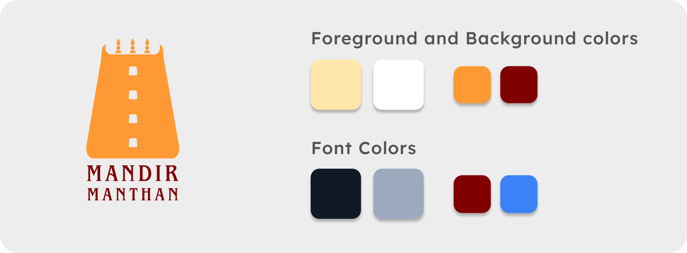

# Auth for Mandir Manthan

Welcome to **Mandir Manthan**! This is a user authentication mobile app designed and developed by me. Built with React Native and Expo, this app provides a seamless way to sign in, sign up, and navigate between screens. 🧘‍♂️


<details>
  <summary>📋 Table of Contents</summary>

- [About The Project](#about-the-project)
- [Built With](#built-with)
- [Getting Started](#getting-started)
  - [Prerequisites](#prerequisites)
  - [Installation](#installation)
- [Usage](#usage)
- [Roadmap](#roadmap)
- [Contributing](#contributing)
- [License](#license)
- [Contact](#contact)
- [Acknowledgments](#acknowledgments)

</details>

## 💡 About The Project

**Mandir Manthan** is a mobile app designed to streamline user authentication. Whether you're signing in or signing up, the app ensures a smooth experience with Firebase as the backend, allowing users to access their data securely.

### Key Features
- 🔑 **SignIn Screen**: Enter your email and password to log in.
- 📝 **SignUp Screen**: Register with your email, password, and confirm password.
- 🏠 **Home Screen**: Navigate to the main screen after successful authentication.

- ## 🎨 Design

### Logo
The logo of **Mandir Manthan** is inspired by a **Gopura**, a Dravidian-style temple tower, symbolizing cultural heritage. The bright orange color used in the logo signifies the richness and vibrancy of our culture. The font chosen for "Mandir Manthan" adds an ancient feel, connecting users with the historical roots of the temple architecture.




### Colors
The app uses a carefully curated color palette to enhance the user experience:

- **Foreground and Background Colors**:
  - `#FFE6A9` - Description of the first color.
  - `#FFFFFF` - Description of the second color.
  - `#FF9933` - Description of the third color.
  - `#800000` - Description of the fourth color.

- **Font Colors**:
  - `#111827` - Description of the first font color.
  - `#9CAABD` - Description of the second font color.
  - `#800000` - Description of the third font color.
  - `#3B82F6` - Description of the fourth font color.

These colors work together to create a visually pleasing and culturally resonant interface.

### Mockup Design

Here’s a visual representation of the app's design, created in Figma:


## 🛠 Built With

- **React Native** - For building the mobile app.
- **Expo** - For a hassle-free React Native environment.
- **Firebase** - Backend for authentication.
- **React Navigation** - Smooth screen transitions.
- **NativeWind** - Tailwind CSS for styling.

## 🛣 Getting Started

To get a local copy up and running, follow these simple steps.

### Prerequisites

- Node.js
- npm or Yarn
- Expo CLI

### Installation

1. Clone the repo:
   ```sh
   git clone https://github.com/satish-hebbal/mandirUI.git
2. Navigate into the project directory
    ```sh
   cd mandirUI
3. Start the Expo development server
    ```sh
   npm start
